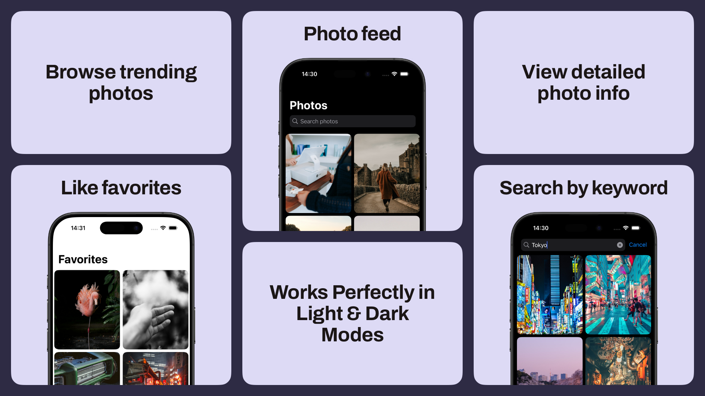

# UnsplashDemoApp

A sleek and performant iOS photo browsing app leveraging the Unsplash API.
Browse trending photos, search by keyword, like favorites, and view detailed photo info — all wrapped in a smooth UIKit experience with clean MVVM + Coordinator architecture.

### ⚙️ Tech Stack

- **UIKit (Code-based UI)** — full manual layout with UICollectionViewCompositionalLayout
- **MVVM + Coordinator** — clean separation of concerns & navigation flow
- **Combine** — reactive updates for likes and UI state
- **Kingfisher** — asynchronous image loading and caching
- **URLSession + MockURLSession** — networking abstraction with test mocks
- **Persistent Storage** — custom StorageService (UserDefaults based) for saving liked photos
- **Unit Testing** — core logic covered by tests

---

## ⭐ Features

- Photo feed with infinite scroll and pull-to-refresh
- Search photos by keyword with debounced input
- Photo details screen with image, author, creation date, likes, and like/unlike button
- Favorites tab reusing photo list UI to show liked photos
- Smooth navigation via Coordinator pattern

---

## 🔧 Architecture Highlights

- Coordinators handle navigation logic and screen flow
- ViewModels expose data and business logic to Views
- Views implement UICollectionView with diffable data source and compositional layout
- Combine publishes reactive updates for UI components (e.g., liked state)
- StorageService abstracts persistence layer for favorites

---

## 🔐 API Key

The Unsplash API key is injected at runtime from your app’s Info.plist or another secure config. 
The API key is stored in Secrets.xcconfig. While this file is typically added to .gitignore, it is included in the repository for easier evaluation.

